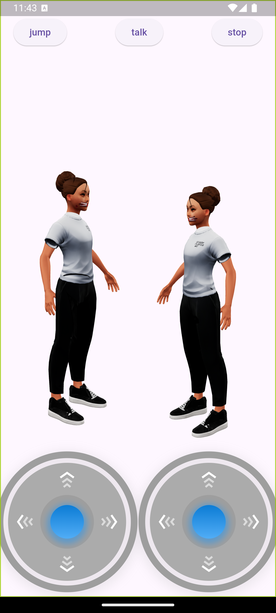

# 3D Model Animation App (Flutter)

## Overview

This Flutter application loads and animates two 3D assets (.glb files). The goal is to demonstrate handling 3D assets, implementing interactive animations, and optimizing rendering performance.

## Features

- **3D Asset Loading**: Supports loading and displaying two .glb files with proper scaling.
- **Animation & Interaction**:
  - Animates the uploaded objects.
  - User interactions determine object movement.
- **Mobile Controls**:
  - On-screen buttons allow changing object direction.
- **Desktop Controls**:
  - Arrow keys (Left/Right) rotate or move objects.
  - Space bar makes objects jump.
- **Performance & Optimization**:
  - Smooth animation transitions.
  - Optimized rendering for responsiveness.
- **Assets & Animations**:
  - Animations sourced from [Ready Player Me Animation Library](https://github.com/readyplayerme/animation-library).
  - 3D assets sourced from [Ready Player Me 3D Library](https://readyplayer.me/).

## Getting Started

### Prerequisites

- Install [Flutter](https://flutter.dev/docs/get-started/install).
- Install required dependencies.

### Installation

1. Clone the repository:
   ```sh
   git clone https://github.com/your-repo/flutter-3d-animation.git
   cd flutter-3d-animation

### 📱 Responsive Design  
- Optimized for various screen sizes and device types.  

### 🌐 App Deployment  
- Hosted on **Appetize.io** for easy access and testing on different devices and browsers.  

---
## Screenshots

- 


## 🛠 Tech Stack  
- **Framework:** Flutter  
- **packages:** Flutter 3D controller and joystick

---

## Installation

1. **Clone the repository**:
    ```bash
    git clone https://github.com/Luckystartech/3d_model_view_project.git
    cd model_viewer_app
    ```

2. **Install dependencies**:
    ```bash
    flutter pub get
    ```

3. **Run the app**:
    ```bash
    flutter run
    ``

## 📂 Project Structure  
```bash
lib  
 ├── features/  
 │   ├── data/          # Data layer (API integration, models)  
 │   ├── domain/        # Business logic  
 │   └── presentation/  # UI components (screens, widgets)  
 └── main.dart          # Entry point  

## Contact

If you have any questions or suggestions, feel free to reach out to me at [gmail](luckyekpebe123@gmail.com).


